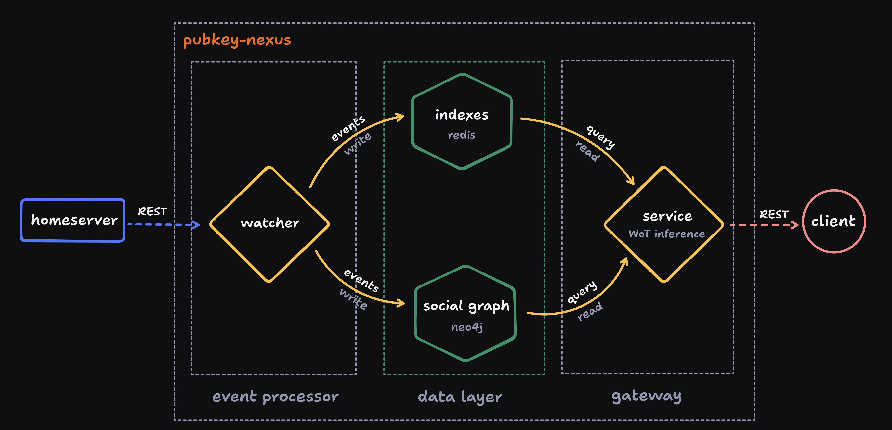

# Pubky Nexus

Pubky Nexus is the central bridge connecting Pubky homeservers with Pubky-App’s social clients. By aggregating events from homeservers into a rich social graph, Nexus transforms decentralized interactions into a high-performance, fully featured social-media-like API. It's designed to support Social-Semantic-Graph (SSG) inference, and more.

## 🌟 Key Features

- **Real-time Social Graph Aggregation**: Nexus ingests events from multiple Pubky homeservers, generating a structured social graph in real time.
- **Full-Content Indexing**: Nexus serves content directly, improving latency and user experience. Clients do not need to locate homeservers to retrieve content unless they wish to perform content attestation. We also envision a light-weight Nexus mode that merely point clients to homeserver locations using pubky uris.
- **High Performance & Scalability**: Built in Rust, Nexus is optimized for speed and efficiency, handling complex social queries across distributed systems with minimal latency.
- **Powerful Social Semantic Graph**: Nexus supports SSG-based interactions, fostering secure and trusted connections between users.
- **Graph-Enhanced Search & Recommendations**: Nexus leverages Neo4j to offer deep insights, relationships, and recommendations based on the social graph.
- **Flexible Caching Layer**: A Redis cache accelerates access to common queries and minimizes database load, ensuring a smooth user experience. Most requests can be served in less than 1 ms at constant time complexity with respect number of users.
- **Rich Observability**: Easily explore the indexed data using [Redis Insight](https://redis.io/insight/) and visualize the graph database with [Neo4j Browser](https://browser.neo4j.io/).

## 🌐 Accessing the API

> ⚠️ **Warning**: The API is currently **unstable**. We are using the `/v0` route prefix while the API undergoes active development and changes. Expect potential breaking changes as we work toward stability.

Nexus provides a REST API, accessible via Swagger UI:

- **Staging API** (latest): [https://nexus.staging.pubky.app/swagger-ui/](https://nexus.staging.pubky.app/swagger-ui/)
- **Production API** (current): [https://nexus.pubky.app/swagger-ui/](https://nexus.pubky.app/swagger-ui/)

You can explore available endpoints, test queries, and view schema definitions directly within Swagger.

## 🏗️ Architecture Overview

Nexus is composed of several core components:

- **service.rs**: The REST API server for handling client requests, querying databases, and returning responses to the Pubky-App frontend.
- **watcher.rs**: The event aggregator that listens to homeserver events, translating them into social graph updates within the Nexus databases.
- **lib.rs**: A library crate containing common functionalities shared by `service` and `watcher`, including database connectors, models, and queries.

### Data Flow



1. **Event Ingestion**: The watcher ingests events from Pubky homeservers and indexes them into our social graph.
2. **Indexing and Caching**: Relationships, common queries, and graph data are cached in Redis for high-speed access. Complex queries use Neo4j.
3. **API Responses**: The service server reads from these indexes to respond to client queries efficiently.


Nexus graph schema.

## ⚙️ Setting Up the Development Environment

To get started with Nexus, first set up the required databases: Neo4j and Redis.

### 1. Configure Databases

1. Clone the repository and navigate to the project directory.
2. Copy the environment template and set up the Docker environment:

   ```bash
   cd docker
   cp .env-sample .env
   docker-compose up -d
   ```

3. Optionally populate the Neo4j database with initial mock data. For that refer to [Running Tests](#running-tests).

4. Run the Nexus service:

   ```bash
   cargo run
   ```

5. **Access Redis and Neo4j UIs**:
   - Redis UI: [http://localhost:8001/redis-stack/browser](http://localhost:8001/redis-stack/browser)
   - Neo4J UI: [http://localhost:7474/browser/](http://localhost:7474/browser/)

## 🚀 Contributing

To contribute to Nexus, follow these steps:

1. **Fork the Repository** and create a feature branch.
2. **Write Tests**: Ensure new features and changes are tested and benchmarked.
3. **Submit a Pull Request** and provide a description of the changes.

### Running Tests

Running tests requires setting up mock data into Neo4j and Redis.  

Use the `mockdb` binary to load the mock data.
```bash
cargo run --bin mockdb [database]
```

`database` is optional and can be either `graph` or `redis`. Not providing any value will sync all the databases.

> If the Redis cache is empty, the nexus-service will handle it automatically. If not follow the steps of warning section

You can optionally pass the `GRAPH_CONTAINER_NAME` env var if your neo4j container in docker has a different name. Defaults to `neo4j`.

Then to run all tests:

```bash
cargo test
```

To test specific modules or features:

```bash
cargo test watcher:users
cargo test test_homeserver_user_event
```

**Benchmarking**:

```bash
cargo bench --bench user get_user_view_by_id
```

## ⚠️ Troubleshooting

If tests or the development environment seem out of sync, follow the [Running Tests](#running-tests) steps to reload the mock data.

## 🌐 Useful Links

- **Swagger API**:
  - Staging: [https://nexus.staging.pubky.app/swagger-ui/](https://nexus.staging.pubky.app/swagger-ui/)
  - Production: [https://nexus.pubky.app/swagger-ui/](https://nexus.pubky.app/swagger-ui/)
- **Local Redis Insight**: [http://localhost:8001/redis-stack/browser](http://localhost:8001/redis-stack/browser)
- **Local Neo4J Browser**: [http://localhost:7474/browser/](http://localhost:7474/browser/)
