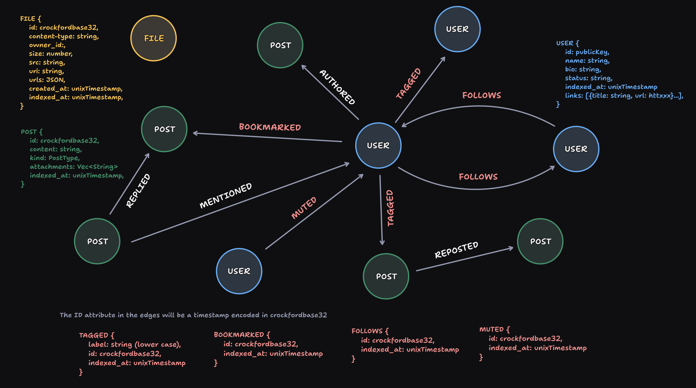

# Pubky-Nexus

The Nexus between Pubky homeservers and Pubky-App social frontend. Pubky Nexus constructs a social graph out of all of the events on pubky-core homeservers and exposes a social-media-like API capable of powerful Web-of-Trust inference.

## 💻 Development Roadmap

### [Pubky Backend Development Roadmap](https://github.com/pubky/pubky-app-backend/issues/1)

## 🏗️ Objective for Alpha v0.1.0 Milestone

Reach feature parity with `skunk-work` indexer improving on the following:

1. High performance: no inefficient lookups, maximum normalization, maximum atomic indexing, full async, full multi-thread, rust performance.
2. Clear vision forward: simplify the implementation of exciting future features: WoT, graph queries, etc.
3. Free of bugs: hopefully.
4. Cleaner dev experience.
5. Moden stack.
6. Excellent observability (browse over our indexes with [redis-insight](https://redis.io/insight/) or graph with [neo4j-browser](https://browser.neo4j.io/))

## 🏠Architecture


- **service.rs**: binary that serves REST request to the pubky-app clients reading from our DBs.
- **watcher.rs**: binary that subscribes to homeservers and populate our DBs
- **lib.rs**: library crate with all of the common functionalities (connector, models, queries) needed for `watcher` and `service`

1. The watcher does effectively work as an aggregator (a translator from Homeserver events to a social network graph).
2. The service reads from the indexes and performs queries to the graph in order to serve responses to the pubky-app clients.
3. As long as it is possible and not too troublesome, most relationships, query results and cache should be indexed by `key: value` and retrieved from Redis. We should take inspiration on current use of LMDB in `skunk-works` (a lot of things can be done using plain `key: value` but some are too troublesome to implement: then we query our graph directly)
4. The social graph DB (Neo4J) is intended for holding a complete view of the network. It should be queried as little as possible but we can abuse it at the beginning in order to complete features faster.



## 👨‍💻 Quick Dev

For auto re-build on save and testing while developing `/service` :

```bash
cargo install cargo-watch

# Copy the .env.example to .env
cp .env-sample .env

# Ideally in two terminals.
# On terminal 1 run:
cargo watch -q -c -w src/ -x run
# You can check the running service on your browser on localhost:8080/v0/info

# On terminal 2 run (for tests to work you need a working /neo4j-example instance with example dataset)
cargo watch -q -c -w tests/ -w macros/*/tests/ -x "test --workspace -- --nocapture"

# Run benchmarks (e.g., get user by ID benchmark)
cargo bench --bench user get_user_view_by_id
```

### Run docker-compose for Redis and Neo4J

```bash
# Go to the docker directory
cd docker

# Copy the .env.example to .env
cp .env-sample .env

# Start the services
docker-compose up -d
```

### Swagger UI

- http://localhost:8080/swagger-ui/

### Real time explore the databases

- Redis: http://localhost:8001/redis-stack/browser
- Neo4J: http://localhost:7474/browser/

### Developing the homeserver watcher

Running the `/tests/` that require the homeserver does not require running a homeserver. However, running the playground or the `watcher.rs` binary does. This is how you can run a pubky homeserver locally in testnet mode.

We are using `pubky` repo as a git submodule of `pubky-nexus`, given that `pubky` is still a private repository and the crates for the client and homeserver are not yet published.

```
git submodule init
git submodule update --init --recursive
cd pubky/pubky-homeserver
cargo run -- --testnet
```

Take a look at the logs for 1) `testnet.bootstrap=["127.0.0.1:6881"]`, 2) your homeserver listening url `http://localhost:15411` and 3) the pubky URI `pubky://8pinxxgqs41n4aididenw5apqp1urfmzdztr8jt4abrkdn435ewo` and make sure your `.env` has the correct settings.